# NFT Auction Marketplace with Chainlink Integration

[](https://opensource.org/licenses/MIT)
[](https://hardhat.org/)
[](https://openzeppelin.com/)
[](https://chain.link/)

A comprehensive NFT auction marketplace built with Hardhat, featuring Chainlink price oracles, UUPS proxy upgrades, and cross-chain functionality.

## 🌟 Features

### Core Functionality
- **NFT Auctions**: Create and manage NFT auctions with real-time bidding
- **Multi-Token Support**: Accept bids in ETH and multiple ERC20 tokens
- **USD Price Conversion**: Real-time price conversion using Chainlink oracles
- **Factory Pattern**: Uniswap V2-like factory for efficient auction management
- **UUPS Proxy Upgrades**: Safe contract upgrades without losing state

### Advanced Features
- **Cross-Chain Auctions**: Bid on auctions from different blockchains using Chainlink CCIP
- **Price Oracle Integration**: Accurate USD valuations for all supported tokens
- **Auction Extensions**: Automatic time extensions for last-minute bids
- **Royalty Support**: Built-in NFT royalty distribution
- **Batch Operations**: Create multiple auctions and mint NFTs in single transactions

### Security & Reliability
- **Reentrancy Protection**: Comprehensive security measures
- **Pausable Contracts**: Emergency pause functionality
- **Access Control**: Role-based permissions
- **Upgrade Safety**: Transparent upgrade mechanisms

## 🏗️ Architecture

### Core Contracts

```
📦 NFT Auction Marketplace
├── 🎨 EnhancedERC721.sol          # Advanced NFT contract with royalties
├── 🏭 NftAuctionFactory.sol       # Factory for creating auctions (Uniswap V2 pattern)
├── 🎯 EnhancedNftAuction.sol      # Individual auction contract
├── 📊 PriceOracleManager.sol      # Chainlink price feed manager
├── 🌉 CrossChainAuctionBridge.sol # CCIP cross-chain functionality
└── 💰 TestERC20.sol               # Test token for demonstrations
```

### Architecture Diagram

```mermaid
graph TB
    User[👤 User] --> Factory[🏭 NftAuctionFactory]
    Factory --> Auction[🎯 EnhancedNftAuction]
    Auction --> Oracle[📊 PriceOracleManager]
    Oracle --> Chainlink[🔗 Chainlink Price Feeds]
    Factory --> NFT[🎨 EnhancedERC721]
    Auction --> Bridge[🌉 CrossChainBridge]
    Bridge --> CCIP[🌐 Chainlink CCIP]
```



## 🚀 Quick Start

### Prerequisites

- Node.js (v18 or later)
- npm or yarn
- Git

### Installation

```bash
# Clone the repository
git clone <repository-url>
cd Hardhat-up

# Install dependencies
npm install

# Copy environment file
cp .env.example .env
# Edit .env with your configuration
```

### Local Development

```bash
# Start local Hardhat network
npx hardhat node

# In another terminal, deploy contracts
npx hardhat deploy --network localhost

# Run the demo
npx hardhat run scripts/demo.js --network localhost

# Run tests
npx hardhat test
```

### Testnet Deployment

```bash
# Deploy to Ethereum Sepolia
npx hardhat deploy --network sepolia

# Deploy to Polygon Mumbai
npx hardhat deploy --network mumbai

# Deploy cross-chain bridge
npx hardhat deploy --tags CrossChain --network sepolia
```

## 📖 Usage Guide

### Creating an Auction

```javascript
// 1. Mint or own an NFT
const tokenId = await nftContract.mint(seller.address, "https://metadata.uri");

// 2. Approve factory to manage NFT
await nftContract.setApprovalForAll(factoryAddress, true);

// 3. Create auction
const auctionTx = await factory.createAuction(
  nftContractAddress,  // NFT contract
  tokenId,            // Token ID
  3600,              // Duration (1 hour)
  ethers.parseUnits("100", 8), // Reserve price ($100 USD)
  [ethers.ZeroAddress, tokenAddress] // Allowed payment tokens
);

// 4. Start auction
const auctionAddress = /* extract from event */;
await factory.startAuction(auctionAddress);
```

### Placing Bids

```javascript
// Bid with ETH
await auction.placeBid(
  ethers.ZeroAddress, 
  ethers.parseEther("0.1"),
  { value: ethers.parseEther("0.1") }
);

// Bid with ERC20 token
const bidAmount = ethers.parseUnits("150", 6); // 150 USDC
await token.approve(auctionAddress, bidAmount);
await auction.placeBid(tokenAddress, bidAmount);
```

### Managing Price Feeds

```javascript
// Add price feed for a token
await priceOracle.setPriceFeed(
  tokenAddress,
  chainlinkFeedAddress,
  "TOKEN/USD"
);

// Get USD value of bid
const usdValue = await priceOracle.convertToUSD(
  tokenAddress,
  amount,
  decimals
);
```

## 🧪 Testing

### Run All Tests

```bash
npx hardhat test
```

### Run Specific Test Suite

```bash
npx hardhat test test/auction-marketplace.test.js
```

### Test Coverage

```bash
npx hardhat coverage
```

### Gas Usage Report

```bash
GAS_REPORT=true npx hardhat test
```

## 🔧 Configuration

### Hardhat Configuration

Edit `hardhat.config.js`:

```javascript
module.exports = {
  solidity: "0.8.20",
  networks: {
    sepolia: {
      url: process.env.SEPOLIA_URL,
      accounts: [process.env.PRIVATE_KEY]
    },
    polygon: {
      url: process.env.POLYGON_URL,
      accounts: [process.env.PRIVATE_KEY]
    }
  },
  namedAccounts: {
    deployer: 0,
    seller: 1,
    bidder: 2
  }
};
```

### Environment Variables

```bash
# .env file
SEPOLIA_URL=https://sepolia.infura.io/v3/YOUR_PROJECT_ID
POLYGON_URL=https://polygon-mumbai.infura.io/v3/YOUR_PROJECT_ID
PRIVATE_KEY=your_private_key_here
ETHERSCAN_API_KEY=your_etherscan_api_key
POLYGONSCAN_API_KEY=your_polygonscan_api_key
```

## 📚 Contract Documentation

### EnhancedERC721

Advanced NFT contract with auction-ready features:

- **Batch Minting**: Mint multiple NFTs in one transaction
- **Royalty Support**: EIP-2981 compliant royalty system
- **Auction Integration**: Pre-approval for auction factory
- **Metadata Management**: Flexible URI storage

### NftAuctionFactory

Factory contract using Uniswap V2 pattern:

- **Deterministic Addresses**: Predictable auction addresses
- **Batch Creation**: Create multiple auctions efficiently
- **Auction Management**: Track and query all auctions
- **Access Control**: Platform fee and settings management

### EnhancedNftAuction

Individual auction contract with advanced features:

- **Multi-Token Bidding**: Accept ETH and ERC20 tokens
- **USD Conversion**: Real-time price conversion
- **Bid Extensions**: Automatic time extensions
- **Refund Management**: Safe bid refund system

### PriceOracleManager

Chainlink oracle integration:

- **Multiple Feeds**: Support for various price feeds
- **Price Validation**: Staleness and sanity checks
- **Decimal Handling**: Normalize different token decimals
- **Batch Operations**: Efficient multi-token queries

### CrossChainAuctionBridge

CCIP-powered cross-chain functionality:

- **Cross-Chain Bids**: Bid from different blockchains
- **Message Validation**: Secure cross-chain communication
- **Fee Management**: Dynamic fee calculation
- **Chain Support**: Configurable supported chains

## 🔐 Security

### Security Features

- **Reentrancy Guards**: All state-changing functions protected
- **Access Control**: OpenZeppelin's access control patterns
- **Pausable Operations**: Emergency pause functionality
- **Upgrade Safety**: UUPS proxy pattern with authorization
- **Input Validation**: Comprehensive parameter validation

### Security Auditing

Before mainnet deployment:

1. **Static Analysis**: Use tools like Slither and MythX
2. **Formal Verification**: Critical functions verification
3. **Professional Audit**: Third-party security audit
4. **Bug Bounty**: Community-driven security testing

## 🌐 Cross-Chain Deployment

### Supported Networks

| Network | Chain ID | CCIP Support | Status |
|---------|----------|--------------|--------|
| Ethereum Sepolia | 11155111 | ✅ | Active |
| Polygon Mumbai | 80001 | ✅ | Active |
| Avalanche Fuji | 43113 | ✅ | Active |
| Arbitrum Sepolia | 421614 | ✅ | Active |
| Base Sepolia | 84532 | ✅ | Active |

### Cross-Chain Setup

1. Deploy contracts on all target networks
2. Configure CCIP routers and chain selectors
3. Set up cross-chain routes and fee structures
4. Test cross-chain message passing

## 📊 Monitoring & Analytics

### Events for Monitoring

- `AuctionCreated`: New auction started
- `BidPlaced`: New bid placed
- `AuctionEnded`: Auction completed
- `CrossChainBidSent`: Cross-chain bid initiated
- `PriceFeedUpdated`: Oracle price updated

### Recommended Tools

- **The Graph**: Index and query auction data
- **Tenderly**: Transaction monitoring and debugging
- **OpenZeppelin Defender**: Automated monitoring and alerts
- **Chainlink Automation**: Automated auction ending

## 🤝 Contributing

1. Fork the repository
2. Create a feature branch: `git checkout -b feature/amazing-feature`
3. Commit changes: `git commit -m 'Add amazing feature'`
4. Push to branch: `git push origin feature/amazing-feature`
5. Open a Pull Request

### Development Guidelines

- Follow Solidity style guide
- Write comprehensive tests
- Update documentation
- Use conventional commits

## 📄 License

This project is licensed under the MIT License - see the [LICENSE](LICENSE) file for details.

## 🙏 Acknowledgments

- [OpenZeppelin](https://openzeppelin.com/) - Smart contract security and standards
- [Chainlink](https://chain.link/) - Decentralized oracle network
- [Hardhat](https://hardhat.org/) - Ethereum development environment
- [Uniswap](https://uniswap.org/) - Factory pattern inspiration

## 📞 Support

- **Documentation**: Check this README and contract comments
- **Issues**: [GitHub Issues](../../issues)
- **Discussions**: [GitHub Discussions](../../discussions)

---

**⚠️ Disclaimer**: This is experimental software. Use at your own risk. Always audit smart contracts before mainnet deployment.
